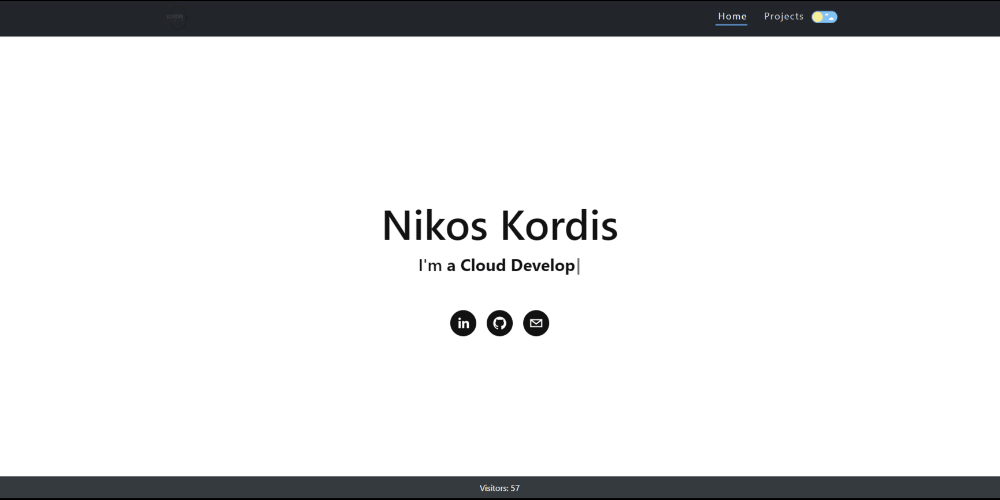

# kordis.cloud: A Serverless Portfolio Website

 This repository houses the source code and configuration files for deploying kordis.cloud, a serverless, cloud-based portfolio website utilizing the AWS Serverless Application Model (SAM). It incorporates a comprehensive suite of AWS services to ensure a scalable, secure, and high-performance web presence.

  Visit the live site at [https://kordis.cloud](https://kordis.cloud).

  

## Components Overview

 -  **Backend:** Serverless Lambda functions, written in Python 3.9, manage functionalities such as visitor tracking. The code for these functions can be found in the `visitor_get_function` and `visitor_put_function` directories.

-  **Database:** Amazon DynamoDB is used to store essential data like visitor counts, providing fast and scalable performance.

-  **Content Delivery Network (CDN):** Amazon CloudFront distributes static website content, ensuring efficient content delivery with reduced latency across the globe.

-  **API Gateway:** This service offers a secure and scalable endpoint for frontend interactions with the backend, efficiently managing API traffic.

-  **DNS Management:** Amazon Route 53 handles DNS records for the domain, directing user requests to the appropriate AWS infrastructure.

-  **Storage and Static Hosting:** Amazon S3 hosts static assets and content for the website, including HTML, CSS, and JavaScript files, ensuring reliable storage and retrieval. S3 also serves as the static website host, delivering content directly to visitors.

-  **Frontend:** Developed with React.js, a modern web framework for a dynamic and interactive experience, detailed in the [web-portfolio README](web-portfolio/README.md). This component is adapted from the [jOlson's repository](https://github.com/johnolson2219/jOlson), updated to include a footer component that integrates visitor tracking functionality.

-  **Infrastructure Management:** All AWS resources utilized by the application are defined and orchestrated via the `template.yaml` file with AWS SAM, facilitating streamlined deployment and management.

-  **Additional Tools and Services:** The project uses AWS Certificate Manager (ACM) for handling SSL/TLS certificates and AWS IAM for managing access controls, ensuring secure and efficient operations.

## Application Deployment

The AWS Serverless Application Model (SAM) CLI is an extension of the AWS CLI that simplifies the process of building and deploying serverless applications using Docker to emulate the AWS environment. Here's what you need to get started:

-  **SAM CLI** - [Install the SAM CLI](https://docs.aws.amazon.com/serverless-application-model/latest/developerguide/serverless-sam-cli-install.html)

-  **Python 3.9** - [Install Python](https://www.python.org/downloads/)

-  **Docker** - [Install Docker Community Edition](https://hub.docker.com/search/?type=edition&offering=community)

To deploy the application for the first time, execute the following commands:
```
sam build --use-container
sam deploy --guided`
```
  These commands will compile your application source and then package and deploy it to AWS. The deployment process will prompt you for:

  -  **Stack Name**: Name your stack, typically aligning with your project name, such as "kordis-cloud".

-  **AWS Region**: Select the AWS region where your application will be deployed.

-  **Confirm changes before deploy**: Choose whether to review changes before they are deployed.

-  **Allow SAM CLI IAM role creation**: Permissions must be explicitly granted to create or modify IAM roles using the `--capabilities CAPABILITY_IAM` flag.

-  **Save arguments to samconfig.toml**: Optionally save your settings to a config file to streamline future deployments.

  
Post-deployment, your API Gateway Endpoint URL will be displayed, providing access to your application.

## Testing Strategy

Testing is a crucial part of ensuring the reliability and stability of the kordis.cloud application. Our testing approach includes:

 -  **Unit Tests:** These test individual components or functions in isolation to ensure that each part performs as expected.

-  **Integration Tests:** These tests check the interaction between components and services to verify that they work together correctly.

-  **End-to-End Tests (E2E):** Simulating real user scenarios, these tests cover the complete flow of the application to ensure that the system meets all business requirements.

  

Tests are defined in the `tests` folder. To run these tests, install the required dependencies and execute the test commands:

```
pip install -r tests/requirements.txt --user

python -m pytest tests/unit -v

python -m pytest tests/integration -v

python -m pytest tests/e2e -v

```

## Continuous Integration and Deployment (CI/CD)

The CI/CD pipeline is managed through GitHub Actions, automating the testing, building, and deployment phases to ensure a seamless workflow and high availability of the application. The process is triggered by pushes to the `dev` branch, following this sequence:

-  **Test Infrastructure:** Validates and tests new code commits using unit and tests.

-  **Build and Deploy Infrastructure:** Once tests pass, the infrastructure code is built and deployed using AWS SAM.

-  **Integration and E2E Testing:** After deployment, further integration and E2E tests ensure the entire system functions as expected.

-  **Deploy Site:** Frontend assets are built and synced to an S3 bucket for static hosting.

-  **E2E Testing:** The E2E tests utilize the Selenium for Python framework to test the frontend, verifying that the application behaves as expected under production-like circumstances.

-   **Changelog Update:** Automatically updates the `CHANGELOG.md` file to include new changes based on conventional commit messages. This step ensures that all significant changes are documented properly and appended to the changelog before merging to the main branch.

-  **Auto-Merge to Main:** Successful deployments and tests trigger an automatic merge from `dev` to `main` to ensure that the main branch always reflects a stable and tested state.

This CI/CD setup ensures that all code pushed to production is thoroughly tested and stable, reducing the risk of issues affecting users and improving the overall quality of the application

## Additional Resources

For more information on SAM and serverless concepts, refer to the [AWS SAM Developer Guide](https://docs.aws.amazon.com/serverless-application-model/latest/developerguide/what-is-sam.html).

Explore more advanced serverless applications through the [AWS Serverless Application Repository](https://aws.amazon.com/serverless/serverlessrepo/).